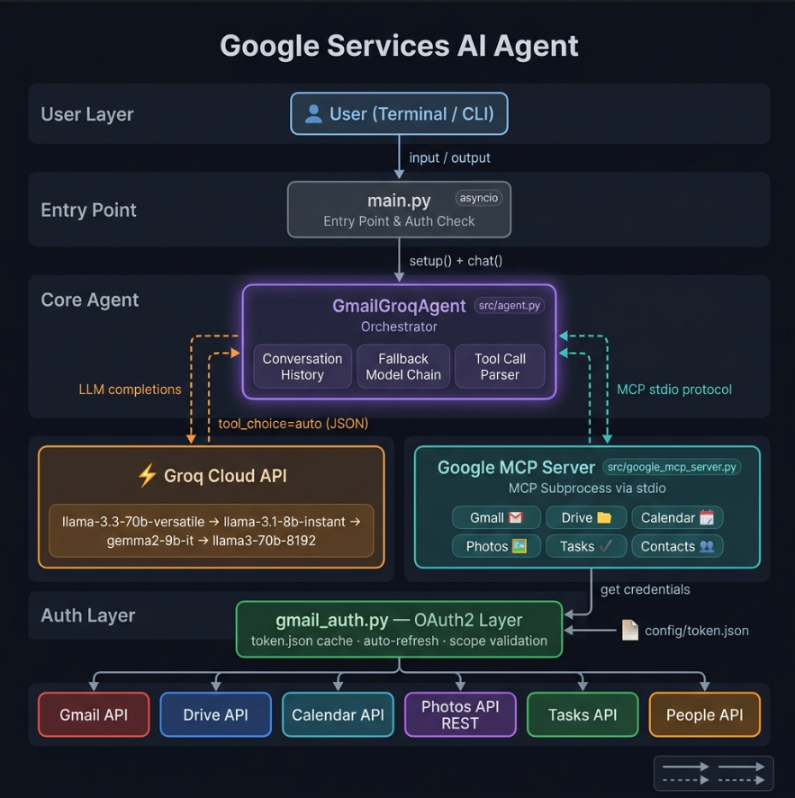

# 🤖 Google Services AI Agent

> A terminal-based personal AI assistant powered by **Groq (LLaMA 3.3-70B)** and the **Model Context Protocol (MCP)**.  
> Chat naturally to control your Gmail, Drive, Calendar, Photos, Tasks, and Contacts — all from one interface.

[](https://python.org)
[](https://console.groq.com)
[](https://modelcontextprotocol.io)
[](https://console.cloud.google.com)

---

## ✨ What It Can Do

```
You: Summarize my unread emails from today
You: Show my calendar events for the next 3 days
You: Create a task: Submit project report by Friday
You: List my recent Google Drive files
You: Search my photos from December 2024
You: Find the phone number in my contacts
```

---

## 🏗️ Architecture



| Component | File | Role |
|---|---|---|
| Entry point | `main.py` | Starts the chat loop |
| Agent | `src/agent.py` | Groq conversation loop + MCP client |
| Google MCP Server | `src/google_mcp_server.py` | All 23 Google tools over stdio |
| Auth | `src/gmail_auth.py` | OAuth2 for all Google services |

---

## 🚀 Setup

### Prerequisites
- Python 3.11+
- A [Google Cloud project](https://console.cloud.google.com) with OAuth credentials
- A free [Groq API key](https://console.groq.com)

---

### Step 1 — Clone & install dependencies

```bash
git clone https://github.com/Sanju562586/GoogleServicesAgent.git
cd GoogleServicesAgent

python -m venv venv
venv\Scripts\activate          # Windows
# source venv/bin/activate     # macOS / Linux

pip install -r requirements.txt
```

---

### Step 2 — Configure environment variables

```bash
copy env.example .env
```

Edit `.env`:

```env
GROQ_API_KEY=gsk_your_groq_api_key_here

# Optional — override the default model
# GROQ_MODEL=llama-3.3-70b-versatile
```

Get your Groq key for free at [console.groq.com](https://console.groq.com).

---

### Step 3 — Set up Google OAuth credentials

1. Go to [Google Cloud Console](https://console.cloud.google.com)
2. Create a project (or use an existing one)
3. Go to **APIs & Services → Library** and enable:
   - ✅ Gmail API
   - ✅ Google Drive API
   - ✅ Google Calendar API
   - ✅ Google Photos Library API
   - ✅ Tasks API
   - ✅ People API (Contacts)
4. Go to **Credentials → Create Credentials → OAuth 2.0 Client ID**
   - Application type: **Desktop app**
5. Download the JSON → rename to `credentials.json` → place in `config/`

> **First run**: A browser window opens for OAuth consent. After approving, `config/token.json` is saved automatically. This only happens once.

---

### Step 4 — Add yourself as a test user

Since the app is in *Testing* mode in Google Cloud, you must add your Gmail address as a test user:

1. Go to **APIs & Services → OAuth consent screen**
2. Scroll to **Test users → + ADD USERS**
3. Add your Gmail address → Save

---

### Step 5 — Run

```bash
python main.py
```

---

## 🛠️ Available Tools (23 total)

### 📧 Gmail
| Tool | Description |
|---|---|
| `gmail_list_emails` | List recent emails from inbox or any label |
| `gmail_search_emails` | Search with Gmail query syntax (`from:`, `is:unread`, `newer_than:1d`) |
| `gmail_get_email` | Read full body of an email by ID |
| `gmail_send_email` | Compose and send a new email |
| `gmail_reply_email` | Reply to an existing email thread |

### 📁 Google Drive
| Tool | Description |
|---|---|
| `drive_list_files` | List files sorted by most recently modified |
| `drive_search_files` | Search by name, type, or Drive query |
| `drive_get_file` | Get file metadata (size, link, owner) |
| `drive_read_file` | Read content of Docs, Sheets (CSV), or text files |
| `drive_create_folder` | Create a new folder |

### 📅 Google Calendar
| Tool | Description |
|---|---|
| `calendar_list_events` | List upcoming events in a time window |
| `calendar_search_events` | Search events by keyword |
| `calendar_create_event` | Create an event with attendees and location |
| `calendar_delete_event` | Delete an event by ID |

### 📸 Google Photos
| Tool | Description |
|---|---|
| `photos_list_albums` | List all photo albums |
| `photos_list_photos` | List photos (optionally from a specific album) |
| `photos_search_photos` | Search by date range or category (SELFIES, LANDSCAPES, FOOD, etc.) |

### ✅ Google Tasks
| Tool | Description |
|---|---|
| `tasks_list_tasklists` | List all task lists |
| `tasks_list_tasks` | List tasks in a task list |
| `tasks_create_task` | Create a new task with optional due date |
| `tasks_complete_task` | Mark a task as completed |

### 👤 Google Contacts
| Tool | Description |
|---|---|
| `contacts_list` | List all contacts |
| `contacts_search` | Search contacts by name or email |

---

## 💬 Example Prompts

```
# Gmail
Show me emails I haven't replied to in the last 3 days
Search for emails from GitHub about pull requests
Send an email to john@example.com saying I'll be late

# Drive
List my recent files
Search for files named "budget"
Read the contents of my Project Plan doc

# Calendar
What do I have scheduled this week?
Create a meeting "Team Standup" tomorrow at 10 AM for 30 minutes
Delete the event with ID <event_id>

# Tasks
Show all my pending tasks
Create a task: Finish the README by tonight
Mark task <id> as done

# Contacts
Find Ramcharan's email address
List all my contacts
```

---

## ⚙️ Configuration Reference

| Variable | Required | Description |
|---|---|---|
| `GROQ_API_KEY` | ✅ Yes | Your Groq API key |
| `GROQ_MODEL` | No | Override model (default: `llama-3.3-70b-versatile`) |

---

## 📂 Project Structure

```
GoogleServicesAgent/
├── main.py                        # Entry point — starts the chat loop
├── requirements.txt               # Python dependencies
├── env.example                    # Environment variable template
├── README.md
├── .gitignore
├── config/
│   ├── credentials.json           # ← you provide this (OAuth client ID)
│   ├── credentials.json.example   # ← reference format
│   └── token.json                 # ← auto-generated after first login
└── src/
    ├── __init__.py
    ├── agent.py                   # Groq agent + MCP client orchestrator
    ├── gmail_auth.py              # Google OAuth2 for all services
    ├── google_mcp_server.py       # Unified MCP server (23 tools)
    └── gmail_mcp_server.py        # Legacy Gmail-only MCP server
```

---

## 🔒 Security Notes

- **`.env` and `config/token.json` are in `.gitignore`** — they are never committed
- OAuth tokens are stored locally in `config/token.json` only
- The app requests only the scopes it uses (principle of least privilege)

---

## 📄 License

MIT © [Sanju562586](https://github.com/Sanju562586)
